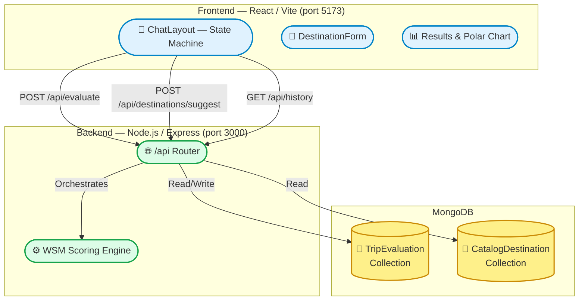
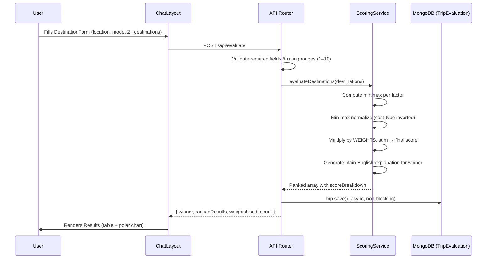
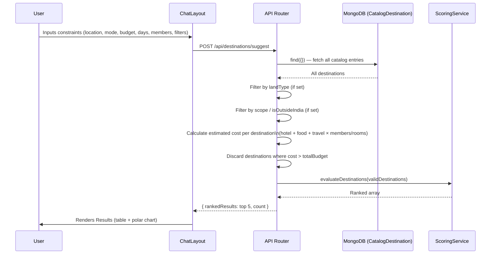
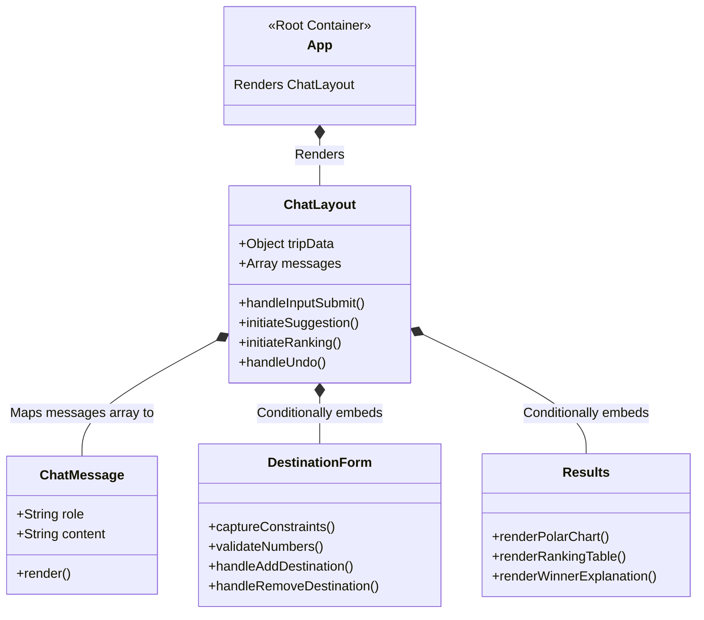
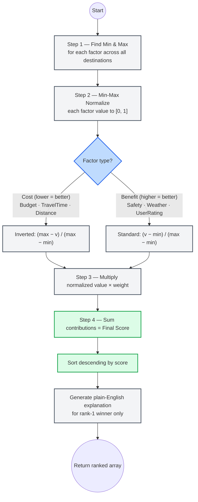

# 🏗️ Decision Companion System — Architecture

This document contains visual diagrams describing the architecture, data flow, component hierarchy, and core decision logic of the Smart Destination Decision System. All diagrams reflect the current implementation state.

---

## 1. High-Level Architecture

The system is split into three layers: a **React/Vite frontend** served on port 5173, an **Express.js backend API** running on port 3000, and a **MongoDB** database managed via Mongoose.



---

## 2. API Endpoints

| Method | Endpoint | Description |
|--------|----------|-------------|
| `POST` | `/api/evaluate` | Manually rank 2+ user-provided destinations via WSM |
| `POST` | `/api/destinations/suggest` | Auto-suggest & rank destinations from the catalog |
| `GET`  | `/api/history` | Return the last 10 saved trip evaluations |

---

## 3. Data Flow — Manual Ranking Mode (`POST /api/evaluate`)

The user manually enters destination details; the engine ranks them using the Weighted Sum Model.



---

## 4. Data Flow — Auto-Suggest Mode (`POST /api/destinations/suggest`)

The user provides constraints; the system filters the catalog and returns the top 5 affordable destinations.



---

## 5. Frontend Component Tree



---

## 6. MongoDB Data Models

### `TripEvaluation` (Manual Ranking History)

```
TripEvaluationSchema
├── startLocation        String  (required)
├── modeOfTravel         String  (required) — Car | Bike | Bus | Train | Flight
├── destinations[]
│   ├── name             String
│   ├── budget           Number  (₹, total estimated cost)
│   ├── travelTimeHours  Number
│   ├── distanceKm       Number
│   ├── safetyRating     Number  (1–10)
│   ├── weatherSuitability Number (1–10)
│   ├── userRating       Number  (1–10)
│   └── imageUrl         String
├── results[]
│   ├── name             String
│   ├── score            Number
│   ├── rank             Number
│   └── scoreBreakdown   Mixed
└── createdAt            Date
```

### `CatalogDestination` (Auto-Suggest Catalog)

```
CatalogDestinationSchema
├── name                 String  (required)
├── scope                String  — "Within India" | "Outside India"
├── landType             String  — "Beach" | "Hills" | "City" | "Forest" | …
├── weather              String
├── distanceFromMajorCities  Mixed  — { Kochi: 130, Trivandrum: 280, … }
├── hotelCostPerDay      Number  (₹ per room per day)
├── foodCostPerDay       Number  (₹ per person per day)
├── baseTravelCost       Mixed   — { Bike: 500, Bus: 350, Car: 1500, Train: 2200, Flight: 5500 }
├── imageUrl             String
└── createdAt            Date
```

---

## 7. Scoring Algorithm (WSM)

The **Weighted Sum Model** inside `scoringService.js` operates in four steps:



### System Weights (fixed)

| Factor | Weight | Type |
|--------|--------|------|
| Budget (₹) | **0.35** | Cost — lower is better |
| Travel Time (hours) | **0.20** | Cost — lower is better |
| Distance (km) | **0.15** | Cost — lower is better |
| Safety Rating (1–10) | **0.15** | Benefit — higher is better |
| Weather Suitability (1–10) | **0.10** | Benefit — higher is better |
| User Rating (1–10) | **0.05** | Benefit — higher is better |
| **Total** | **1.00** | |
